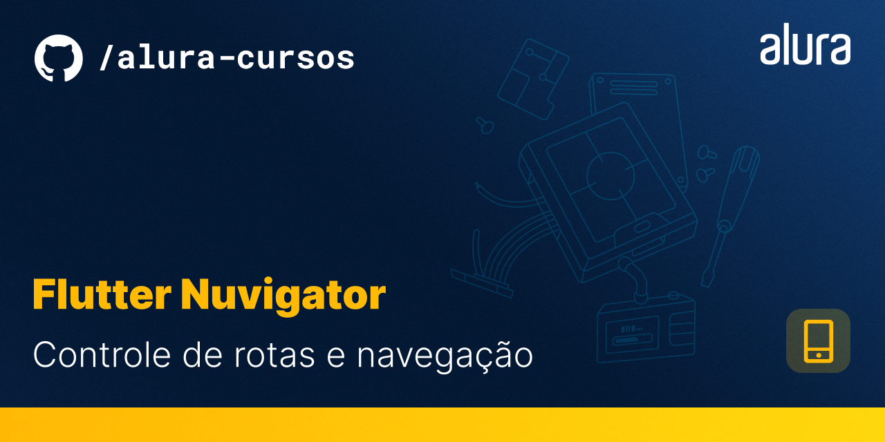

# Ecommerce Orgs

Descreva o que é o projeto e o que ele faz

## 🔨 Funcionalidades do projeto

App de simulação de um e-commerce para produtos naturais para o curso de personalização nuvigator no Flutter com Dart.


## ✔️ Técnicas e tecnologias utilizadas

**Faça uma lista de tecnologias e técnicas utilizadas (a justificativa e descrição são opcionais)**:

- `rootBundle`: leitura de dados vindos de um arquivo json
- `componentização`: os componentes personalizados do projeto encontram-se na pasta "components"
- `centralização de cores`: todas as cores utilizadas no app vêm de um arquivo chamado app_colors que aumenta o poder de personalização sem grande impacto na lógica do código.
- `centralização de imagens`: todas as imagens utilizadas no app vêm de um arquivo chamado app_images que aumenta o poder de personalização sem grande impacto na lógica do código.
- `nuvigator` nas branches a partir da aula_2 utilizamos uma biblioteca chamada [nuvigator](https://github.com/nubank/nuvigator) que nos possibilita manipular o fluxos das rotas, parâmetros, navegação aninhada e afins.
 
## 📁 Acesso ao projeto

**O acesso ao projeto está separado da seguinte forma:**
```
start
├── aula_1
├── aula_2
├── aula_3
├── aula_4
└── main
```

A branch [start]() é o ponto de partida do repositório, é partindo dela que desenvolveremos a aula_1. Por sua vez, a aula_2 é uma continuação da aula_1 e assim vai sucessivamente. A branch main é a final, nela você encontra o código final criado no curso até a aula_4

## 🛠️ Abrir e rodar o projeto

**Para executar este projeto você precisa:**

- Ter o [Flutter](https://flutter.dev/docs/get-started/install) instalado na sua máquina
- Ter algum éditor de códigos ou IDE como o [Android Studio](https://developer.android.com/studio) ou [Intellij Idea](https://www.jetbrains.com/pt-br/idea/download/). 

Caso opte por IDEs como as duas sugeridas acima, o processo de execução do aplicativo funcionará através de um botão de play na parte superior que ambas dispõem. Caso escolha rodar o projeto via linha de comandos, utilize o comando `flutter run`. Lembre-se de antes de executar o comando de navegar até a pasta do projeto antes. 

Para mais instruções sobre a configuração do ambiente, recomendamos a leitura do artigo [Flutter - Como configurar o ambiente de desenvolvimento](https://www.alura.com.br/artigos/flutter-como-configurar-o-ambiente-de-desenvolvimento)

## 📚 Mais informações do curso

O curso de nuvigator tem o foco em ensinar como manipular as rotas de um aplicativo Flutter primeiramente com os mecanismos nativos, pilha e nomeada. Após aprendermos estas formas, migramos para a utilização da biblioteca [nuvigator](https://github.com/nubank/nuvigator) que proporciona uma forma muito mais rápida e com menos código para criar e gerenciar rotas nomeadas. Aprendemos como criar um nuvigator anônimo, instanciado, personalizar rotas, passagens de parâmetros e navegação aninhada (nested navigation).
